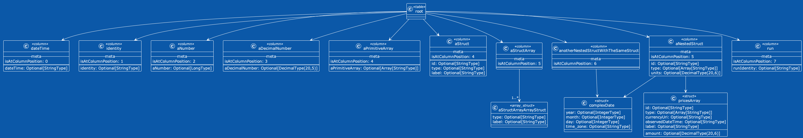

# Hive Print Schema to PUML Class Diagram 

Ok.  This is a little wacky.  We can load a Hive table into a dataframe (in DataBricks), execute `df.printSchema()`, capture the textual the output, throw that into a file, and convert it into a PUML class diagram.  Very useful when....answers on a postcard (do these still exist?  As a media for sending textual data long distances.  Anyway...).

One thing this might help with is visualising the hive schema.  Who knows.


## CLI

The CLI description can be seen by running the CLI. If you're using Jobsworthy directly, the CLI is already defined in
the `pyproject.toml`. Otherwise, add it to the project's `pyproject.toml`.

```shell
[tool.poetry.scripts]
puml = "jobsworthy.structure.puml.cli:cli"
```

Then run the cli to get help

```shell
poetry run puml generate --help
```

To generate PUML class diagram:

```shell
 poetry run puml puml-from-print-schema -s print_schema_output.txt -m some-model-name  -p my_class_diagram.puml  
```

## What it Works With

The generated PUML is a reasonably close approximation.  Aspects of the generated PUML will need to editing:
+ The Table name is not known.
+ Usually no cardinality is applied to relationships.  The only case where this occurs is with columns which are array of structs.  Then a fixed "1..*" is added.

The following example is the maximum set of structural patterns the generator has been tested with.

```text
root
 |-- dateTime: string (nullable = true)
 |-- identity: string (nullable = true)
 |-- aNumber: long (nullable = true)
 |-- aDecimalNumber: decimal(20,5) (nullable = true)
 |-- aPrimitiveArray: array (nullable = false)
 |    |-- element: string (containsNull = true)
 |-- aStruct: struct (nullable = true)
 |    |-- id: string (nullable = true)
 |    |-- type: string (nullable = true)
 |    |-- label: string (nullable = true)
 |-- aStructArray: array (nullable = true)
 |    |-- element: struct (containsNull = true)
 |    |    |-- type: string (nullable = true)
 |    |    |-- label: string (nullable = true)
 |-- aNestedStruct: struct (nullable = true)
 |    |-- id: string (nullable = true)
 |    |-- type: array (nullable = true)
 |    |    |-- element: string (containsNull = true)
 |    |-- units: decimal(20,6) (nullable = true)
 |    |-- complexDate: struct (nullable = true)
 |    |    |-- year: integer (nullable = true)
 |    |    |-- month: integer (nullable = true)
 |    |    |-- day: integer (nullable = true)
 |    |    |-- time_zone: string (nullable = true)
 |    |-- pricesArray: array (nullable = true)
 |    |    |-- element: struct (containsNull = true)
 |    |    |    |-- id: string (nullable = true)
 |    |    |    |-- type: array (nullable = true)
 |    |    |    |    |-- element: string (containsNull = true)
 |    |    |    |-- amount: decimal(20,6) (nullable = true)
 |    |    |    |-- currencyUri: string (nullable = true)
 |    |    |    |-- observedDateTime: string (nullable = true)
 |    |    |    |-- label: string (nullable = true)
 |-- anotherNestedStructWithTheSameStruct: struct (nullable = true)
 |    |-- complexDate: struct (nullable = true)
 |    |    |-- year: integer (nullable = true)
 |    |    |-- month: integer (nullable = true)
 |    |    |-- day: integer (nullable = true)
 |    |    |-- time_zone: string (nullable = true)
 |-- run: struct (nullable = true)
 |    |-- runIdentity: string (nullable = true)
```

The generated PUML can be found [in the test fixtures](../../tests/fixtures/puml.puml)

And the diagram looks like this.



## Limitations

The current limitations are as follows:

+ It does not create 2 classes with the same name, but it only checks on class name.
+ Optionally defined at the column level is not processed.
+ It doesn't support taking the output PUML and transforming it into the table structure DSL.  The DSL doesn't work with the various struct types.  
