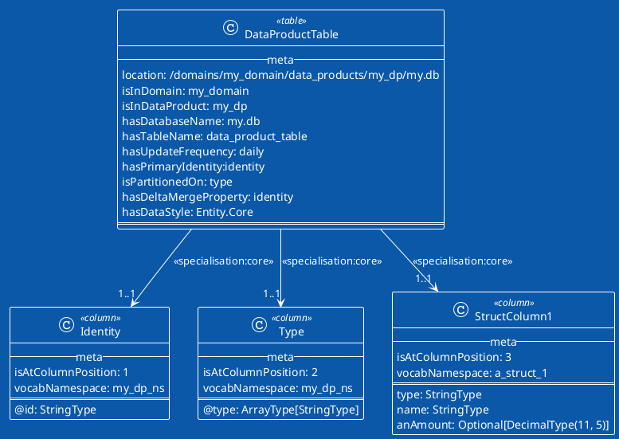

# Plant UML to Hive Table Schema

The PUML to Schema module generates a [Table Schema and Vocab](table-schema.md) from a Plant UML Class Diagram. This is
not some retro-2000's model-driven-architecture malarkey. Rather its a little helper that applies a one-way only (and
once only) transformation of a PUML class diagram to a table structure python DSL definition. Why would you do this?
Perhaps a class model is the first design artefact used to describe the Hive schema. If not. Just go straight to the
DSL.

## CLI

The CLI description can be seen by running the CLI. If you're using Jobsworthy directly, the CLI is already defined in
the `pyproject.toml`. Otherwise, add it to the project's `pyproject.toml`.

```shell
[tool.poetry.scripts]
puml = "jobsworthy.structure.puml.cli:cli"
```

Then run the cli to get help

```shell
poetry run puml generate --help
```

To generate a schema DSL and vocab from a PUML class diagram use:

```shell
poetry run puml generate -p uml_model.puml -v vocab.py -s schema.py
```

You can also generate a stub Jobsworthy repo definition from the databse and table `--meta--`, like so:

```shell
poetry run puml generate -p uml_model.puml -r repo.py

```

## UML Modelling Conventions

We'll look at the PUML modelling conventions by example.



### Meta

All class types support a meta section. This section provides properties that aid in creating the schema and vocab. the
meta section must always start withe `--meta--` and complete with `===`

```puml
class AColumn <<column>> {
    --meta--
    isAtColumnPosition: 3
    ===
}
```

### Table

Define a table `class` using the stereotype `<<table>>`. The table class must include relationships to all column
classes.

The `--meta--` section is not currently used.

### Column

Define a column `class` using the stereotype `<<column>>`.

The meta section has the following properties:

+ `isAtColumnPosition: n`, where `n` is a unique int. In Hive schemas the columns are ordered. This meta property
  describes the position of the column.  `n` does not have to be a sequence of integers. The columns are sorted on
  ascending `n`. There are no gaps in the final generated columns.
+ `vocabNamespace: x`, where `x` is a string. Optional. The prefix to be used when creating the vocab dict. Note, `x` is
  camelCased when generating the model (to fit with the column name conventions, although not with Python). If not
  provided, the vocab properties all exist at the root of the dict.

Class properties are used to define the columns structure. While PUML does not assume any structure for a class
property, its just a string, the transformer uses a specific syntax for defining a column property:

`<property_name>:<type-definition>`

+ `property_name`: A string with no spaces, usually in camelcase.
+ `type-definition`: A syntax which allows a PySpark datatype to be generated by the DSL:
    + `Optional`: When a property is optional, surround the type with `Optional[]`
    + `Array`: When the property is a collection of primitive types, surround the type with `Array[]`.
    + `StringType`: Defines a `StringType` PySpark datatype.
    + `LongType`: Defines a `LongType` PySpark datatype.
    + `DecimalType`: Defines a `DecimalType` PySpark datatype. Provide precision and scale enclosed in `()`. For
      example, `DecimalType(11,5)`.

The following example shows most of the syntax combinations.

```puml
class StructColumn1 <<column>> {
    --meta--
    isAtColumnPosition: 3
    vocabNamespace: a_struct_1
    ===
    @type: ArrayType[StringType]
    name: StringType
    aLong: LongType
    anAmount: DecimalType(11, 5)
    anOptionalAmount: Optional[DecimalType(11, 5)]
    multipleOptionalAmounts: Optional[ArrayType[DecimalType(11, 5)]]
}
```

### Relationships

Relationships must be provided linking the `<<table>>` with the `<<column>>` classes. The relationship must be directed,
that is, `<--` or `-->`. An optional stereotype or name for the relation can be provided, however this is not used by
the generator.

```puml
DataProductTable --> "1..1" Identity: <<specialisation:core>>
```

## Limitations

The current limitations are as follows:

+ Its only been tested on a few PUML models. And it uses Regex. So. Ya know!
+ Only supports simple column types; either primitive types or struct columns containing primitive types.
+ Only deals with 1 table in a DB.
